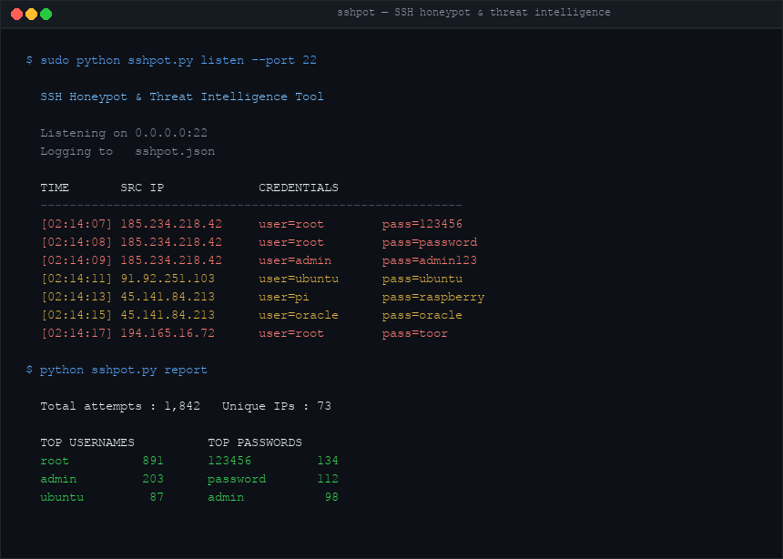

# SSHPot



An SSH honeypot that emulates a real OpenSSH server to capture attacker credentials, commands, and behavior. Generates threat intelligence reports with top IPs, usernames, passwords, and credential combos.

## Features

- **Fake SSH server** — impersonates `OpenSSH_8.9p1 Ubuntu` with a real RSA host key
- **Credential capture** — logs every username/password and public key attempt
- **Command logging** — records exec commands attempted post-auth
- **Threat intelligence reports** — top attacker IPs, usernames, passwords, combos, and hourly timeline
- **IOC export** — dump attacker IPs as a plain-text indicator-of-compromise list
- **Fully concurrent** — handles hundreds of simultaneous connections via threading
- **JSON log format** — structured logs for easy parsing or SIEM ingestion

## Installation

```bash
pip install -r requirements.txt
```

## Usage

### Start the Honeypot

```bash
# Listen on port 2222 (no root required)
python sshpot.py listen --port 2222

# Listen on port 22 (requires root/sudo)
sudo python sshpot.py listen --port 22

# Bind to specific interface
python sshpot.py listen --port 2222 --host 0.0.0.0
```

### Analyze Captured Data

```bash
# Generate threat intelligence report
python sshpot.py report

# Show top 20 instead of top 10
python sshpot.py report --top 20
```

### Export Attacker IPs

```bash
python sshpot.py export --output attacker_ips.txt
```

## Example Output

**Live capture:**
```
  Listening on 0.0.0.0:2222
  Logging to   sshpot.json

  TIME       SRC IP             CREDENTIALS
  ---------- ------------------ ----------------------------------------
  [14:03:11] 185.234.218.42     user=root                pass=123456
  [14:03:12] 185.234.218.42     user=root                pass=password
  [14:03:13] 185.234.218.42     user=admin               pass=admin
  [14:03:15] 91.92.251.103      user=ubuntu              pass=ubuntu
  [14:03:16] 45.141.84.213      user=pi                  pass=raspberry
```

**Threat report:**
```
  SSHPOT THREAT INTELLIGENCE REPORT
  ============================================================
  Total attempts  : 1,842
  Password auth   : 1,801
  Pubkey auth     : 41
  Unique IPs      : 73
  Unique users    : 94
  Unique passwords: 312

  TOP 5 SOURCE IPs:
    185.234.218.42        412  ████████████████
    91.92.251.103         287  ███████████
    45.141.84.213         201  ████████

  TOP 5 USERNAMES:
    root                  891
    admin                 203
    ubuntu                 87
    pi                     44
    user                   31

  TOP 5 PASSWORDS:
    123456                134
    password              112
    admin                  98
    root                   76
    12345678               54
```

## Log Format

Each attempt is stored as newline-delimited JSON:

```json
{"timestamp": "2024-01-15T14:03:11Z", "src_ip": "185.234.218.42", "src_port": 51423, "username": "root", "password": "123456", "auth_type": "password"}
```

Fields: `timestamp`, `src_ip`, `src_port`, `username`, `password` or `pubkey`, `auth_type`

## Deployment Tips

- Run on a cloud VPS (DigitalOcean, Linode, AWS) exposed to the internet — you'll see real attacks within minutes
- Use `--port 2222` during testing; switch to `22` in production (requires root)
- Pair with a firewall rule to allow inbound on the honeypot port only
- Set up a cron job to run `python sshpot.py report` daily

## Legal

Only deploy on systems you own. Never use honeypot data to retaliate against attackers.
